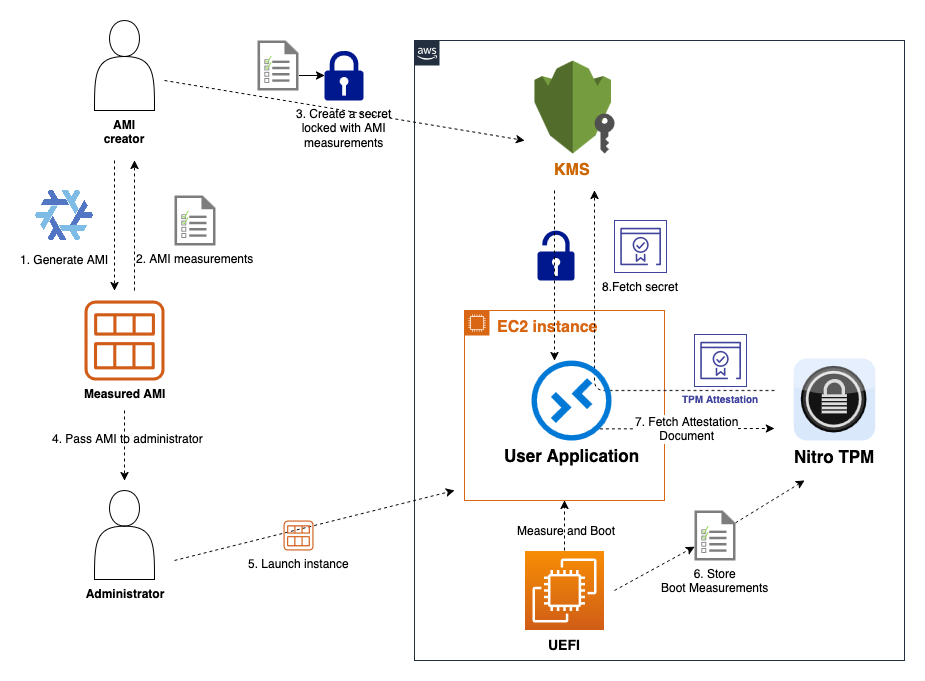
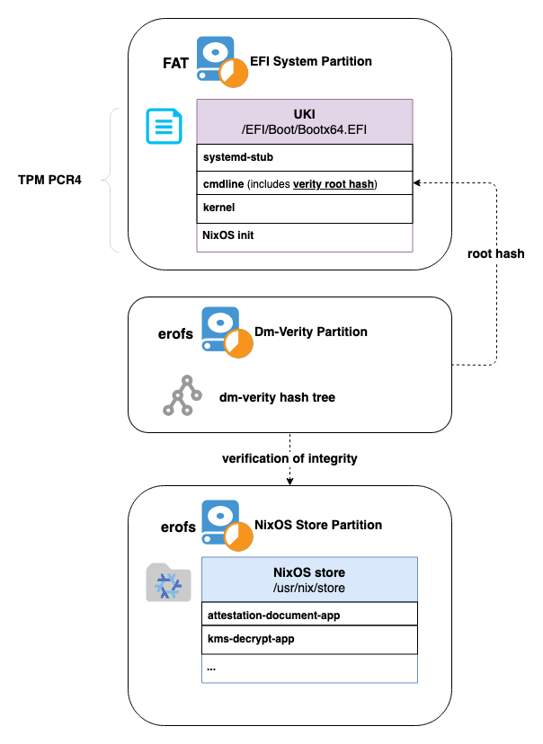

# Nix Attestable AMI Builder

The Nix Attestable AMI Builder helps creating [Attestable AMIs](https://docs.aws.amazon.com/AWSEC2/latest/UserGuide/attestable-ami.html) which are confidential, attestable, and reproducible EC2 AMI images. It's designed for workloads that require enhanced security, where the initial state of the EC2 instance needs to be cryptographically measured and verified before any confidential data is bootstrapped on the system.

It provides the Nix framework to build read-only, bit-by-bit reproducible, and measurable EC2 AMIs. These AMIs contain all required attestation logic and helper tools for boilerplate actions, such as extracting TPM attestation reports or decrypting secrets from KMS using such attestation reports.

## How it works



1. Owner of the payload generates an Attestable AMI with the help of this NIX tooling. The tooling helps to harden the image and ensures any instance launched from it does not provide operator access.
2. The generation flow measures the image contents the same way as an instance's UEFI firmware would do during boot. The builds are fully reproducible. The same locked source always builds into an identical AMI which produces the same hash.
3. The Attestable AMI owner creates a KMS secret locked to measurements of newly created AMI.
4. The Attestable AMI owner passes the AMI to a 3rd party
5. The 3rd party runs an instance based on the Attestable AMI on Nitro.
6. During boot, UEFI measures the AMI and securely stores the measurements in [Nitro TPM](https://docs.aws.amazon.com/AWSEC2/latest/UserGuide/nitrotpm.html)
7. The user application inside the instance fetches the NitroTPM attestation report which contains boot measurements and is signed by a trusted AWS certificate.
8. The User application requests a KMS secret providing the attestation reports with all the boot measurements. If they match the golden reference measurements specified in KMS key policy user application receives required secret in the environment that matches the expectations of AMI creator.

### What is an Attestable AMI



An Attestable AMI is an Amazon Machine Image with a corresponding cryptographic hash that represents all of its contents. The hash is generated during the AMI creation process, and it is calculated based on the contents of that AMI, including the applications, code, and boot process.

You can build an Attestable AMI based on different Operating Systems. A NixOS based Attestable AMI builds a read-only, bit-by-bit reproducible, and measurable Attestable AMI.

The NixOS package store (`/usr/nix/store`) resides on a separate read-only [erofs](https://en.wikipedia.org/wiki/EROFS) partition, containing essential binaries like Attestation Document and KMS Decrypt applications. Users can extend their NixOS with desired configurations and packages, providing flexibility while maintaining security.

To ensure integrity, the Nix store is verified using [`dm-verity`](https://docs.kernel.org/admin-guide/device-mapper/verity.html), with its hash tree stored on a separate read-only partition. The EFI System Partition (ESP) contains a single [Unified Kernel Image (UKI)](https://github.com/uapi-group/specifications/blob/main/specs/unified_kernel_image.md) binary, which includes the kernel, command line (with `dm-verity` root-hash), and initrd.

The UKI binary is measured by the UEFI stage, with the measurement stored in TPM PCR4. This measurement is key to the integrity of the entire AMI and can be used in KMS key policies for decrypting secrets. Any change to system components (sample apps or NixOS config) will alter the `dm-verity` root-hash, which is passed in the UKI command line and ultimately reflected in the TPM PCR4 measurement.

### Getting started

To build Nix based Attestable AMIs, we provide a [Nix Flake](flake.nix). This flake exposes several [binary packages](tee/packages.nix) that can be used within your own NixOS configuration:

* `nitro-tpm-attest` - Application to fetch TPM attestation document.
* `nitro-tpm-kms-decrypt` - Call KMS Decrypt with attestation document attached.

Please note that in order to ensure reproducibility one needs to save and commit the lock file (`flake.lock`).

To build a complete measured image in RAW format, use the `tee-image` library function. This function packs a preconfigured NixOS with `nitro-tpm-attest` and `nitro-tpm-kms-decrypt` binaries, configures `dm-verity`, and packages the boot chain in a UKI image. The resulting artifacts include precalculated PCR4 measurements for TPM, which can be used as golden records for KMS key policies.

Users can extend the NixOS configuration within `tee-image`. Here's an example:
```nix
{
  description = "Test Attestable AMI";
  inputs = {
    nixpkgs.url = "nixpkgs/nixos-unstable";
    flake-utils.url = "github:numtide/flake-utils";
    nitro-tee.url = "path:./";
  };
  outputs = { self, nixpkgs, flake-utils, nitro-tee, ... }:
    flake-utils.lib.eachDefaultSystem
      (system:
        let
          pkgs = nixpkgs.legacyPackages."${system}";
        in
        {
          packages.raw-image = nitro-tee.lib.${system}.tee-image {
            userConfig = { config, pkgs, ... }: {
                # NixOS user extension
                systemd.services.hello-world = {
                    description = "Hello World Service";
                    wantedBy = [ "multi-user.target" ];
                    serviceConfig = {
                        Type = "oneshot";
                        ExecStart = "${pkgs.bash}/bin/bash -c 'echo Hello World'";
                    };
                };
                # ...
            };
          };
        }
      );
}
```
Then the image can be built with:
```bash
nix build .#raw-image
```

We also provide additional tools to streamline the AMI creation process:

* `create-ami`: A Nix Flake app for uploading the RAW image as an EC2 AMI. It uses the [EBS direct API](https://docs.aws.amazon.com/ebs/latest/userguide/ebs-accessing-snapshot.html) to create an EBS snapshot and then generates a new AMI without launching an instance. Usage:
```bash
nix run .#create-ami -- result/nixos-tee_1.raw
```
* `boot-uefi-qemu`: A debugging tool that uses QEMU to load the RAW image with a software-emulated TPM. Note that this environment cannot start the full attestation flow. Usage:
```bash
nix run .#boot-uefi-qemu -- result/nixos-tee_1.raw
```

## Nix Web Server Example

For an example for how you can use the builder flake to create your own Attestable AMIs, you can look at the [Nix Web Server Example](examples/nginx-kms/). This example demonstrates how to build a minimalistic [Attestable AMI](https://docs.aws.amazon.com/AWSEC2/latest/UserGuide/attestable-ami.html) with NGINX serving incoming decryption requests. The decryption is performed using a symmetric key, which is itself decrypted using AWS KMS based on attestation policy with AMI measurements.

You can use it as a starting point to create your own [Attestable AMI](https://docs.aws.amazon.com/AWSEC2/latest/UserGuide/attestable-ami.html).
