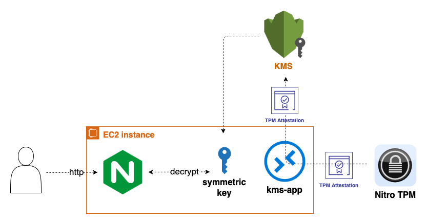

# Nix Web Server Example

This example demonstrates how to build a minimalistic Attestable AMI with NGINX serving incoming decryption requests. The decryption is performed using a symmetric key, which is itself decrypted using AWS KMS based on attestation policy with AMI measurements.



[Full details on the Nix Attestable AMI Builder](../../README.md)

## Prerequisites

Before you begin, ensure you have the following:

- AWS CLI configured with appropriate permissions
- Nix package manager installed
- `jq` command-line JSON processor

## Getting Started
Follow these steps to set up and test the Attestable AMI:

1. **Configure AWS Credentials**

You can configure AWS credentials using one of the following methods:

**Method A: Using AWS CLI Configure (Recommended)**

Configure your AWS credentials using the AWS CLI:

```sh
# For default profile
aws configure

# For a specific profile (useful for multiple accounts)
aws configure --profile myprofile
```

This will prompt you for:
- AWS Access Key ID
- AWS Secret Access Key
- Default region name (e.g., `us-east-2`)
- Default output format (e.g., `json`)

More information can be found on the [official documentation page](https://docs.aws.amazon.com/cli/latest/userguide/cli-configure-files.html).

**Method B: Export Environment Variables**

Alternatively, you can export the required AWS credentials and default region to your current shell:

```sh
export AWS_ACCESS_KEY_ID=<AWS_ACCESS_KEY_ID>
export AWS_SECRET_ACCESS_KEY=<AWS_SECRET_ACCESS_KEY>
export AWS_SESSION_TOKEN=<AWS_SESSION_TOKEN>
export AWS_DEFAULT_REGION=us-east-2
```

**Using Profiles**

If you configured a specific profile, you can use it by setting the AWS_PROFILE environment variable:

```sh
export AWS_PROFILE=myprofile
```

The `start.sh` script will automatically detect credentials from either environment variables or your AWS configuration.

2. **Create Test Setup**

Run the following script to build the Attestable image and set up the necessary AWS resources:
```sh
./scripts/start.sh
```
This script performs the following actions:

* Builds an image with NixOS containing:
    * [KMS decrypt application](https://github.com/aws/NitroTPM-Tools/blob/main/nitro-tpm-attest/examples/kms_decrypt.rs) for fetching attestation documents and decrypting ciphertexts
    * [Systemd service](./kms-init.nix) to decrypt and store the symmetric key on system boot
    * NGINX service using a [fcgi script](./fcgi-script.nix) for decrypting incoming requests
* Creates an AMI from the image using EBS direct API
* Sets up AWS resources including an instance role, KMS key with image measurements, and encrypted symmetric key
* Launches an EC2 instance using the new AMI. The instance's user data includes the ciphertext of the symmetric key and the KMS key ID needed for decryption.

**Note:** Make sure to copy the public address of the launched instance, as you'll need it for the next step.

3. **Test the Setup**
Use the public IP address of the launched instance to test the setup:
```sh
./scripts/test.sh -s <INSTANCE_IP> -m "Hello Confidential Compute World!"
...
Test passed: The server successfully decrypted the message.
```
This test encrypts the input message, sends it to the server, and verifies the decrypted output.

4. **Clean Up Resources**
To remove all created resources, run:
```sh
./scripts/clean.sh
```
