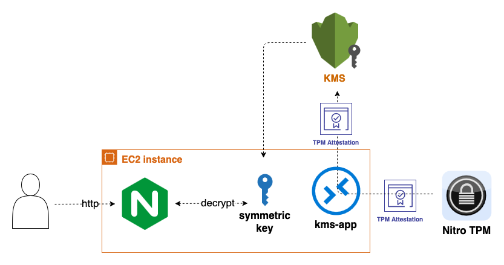

# Nix Web Server Example

This example demonstrates how to build a minimalistic Attestable AMI with NGINX serving incoming decryption requests. The decryption is performed using a symmetric key, which is itself decrypted using AWS KMS based on attestation policy with AMI measurements.



[Full details on the Nix Attestable AMI Builder](../../README.md)

## Prerequisites

Before you begin, ensure you have the following:

- AWS CLI configured with appropriate permissions
- Nix package manager installed
- `jq` command-line JSON processor

## Important Note on Secure Boot and Reproducibility

Secure boot signing is a **post-build step** performed outside of the nix derivation. This keeps private signing keys (`db.key`) out of the nix store and cache.

The build workflow is:
1. `nix build .#raw-image` — produces an unsigned image and UKI
2. `nix run .#sign-efi-image -- <image-dir> <keys-dir> > tpm_pcr.json` — signs the UKI, patches the ESP, emits `uefi_data.aws`, and prints the full PCR set (PCR4 + PCR7) to stdout
3. `nix run .#create-ami -- result/nixos-tee_1.raw uefi_data.aws` — registers AMI with UEFI secure boot data

In production, reuse a consistent secure boot identity (the same GUID + PK/KEK/db certs) for reproducible measurements — see [Reproducible PCR7](#reproducible-pcr7-persist-the-whole-identity-not-just-db) below. `--secrets-manager` handles this automatically.

## Using AWS Secrets Manager for Signing Keys

The `--secrets-manager` flag enables storing and retrieving the secure boot **golden identity** via AWS Secrets Manager. This keeps the private key (`db.key`) completely out of the nix store and build cache. The private key is **never written to the local filesystem at all**: `sign-efi-image` fetches it from Secrets Manager and streams it straight into `sbsign` through an in-memory file descriptor, so it exists only in process memory for the duration of the signing call.

### Reproducible PCR7: persist the whole identity, not just db

PCR7 measures the UEFI secure boot policy — the byte-exact contents of the PK, KEK, and db EFI Signature Lists (ESLs). Each ESL embeds the owner GUID and the DER-encoded certificate, so PCR7 changes if the GUID or **any** of the PK/KEK/db certs change. Persisting only `db.key`/`db.crt` is therefore not enough for a reproducible PCR7: freshly generating PK/KEK and a random GUID on each run produces a different PCR7 every deployment.

To make PCR7 reproducible, `--secrets-manager` persists the entire golden identity as **three** secrets:

| Secret name | Contents | Purpose |
|-------------|----------|---------|
| `nitrotpm-sb-signing-key-<ts>` | `db.key` | signs the UKI (private key) |
| `nitrotpm-sb-signing-cert-<ts>` | `db.crt` | rebuilds `db.esl` |
| `nitrotpm-sb-identity-<ts>` | JSON `{guid, pk_crt, kek_crt}` | rebuilds `PK.esl` / `KEK.esl` with a fixed owner GUID |

On each run the ESLs are rebuilt deterministically from these fixed inputs (`cert-to-efi-sig-list` is byte-deterministic given a fixed cert + GUID), so PCR4 **and** PCR7 are identical across deployments. The corresponding ARNs are stored in `artifacts/resources.json` (`SECRET_ARN`, `SECRET_CERT_ARN`, `IDENTITY_ARN`) and reused automatically.

The PK/KEK **private** keys are never persisted or uploaded: the UEFI variable store is built with `uefivars -i none`, which consumes the ESLs (not the `.auth` enrollment files), so the PK/KEK private keys are unused after cert generation.

The db signing **private** key (`db.key`) stays in Secrets Manager and is never written to the local filesystem during a deployment. At signing time `sign-efi-image` receives its Secret ARN (`--db-key-arn`), fetches the PEM into memory, and streams it into `sbsign` via an in-memory file descriptor. Only the public `db.crt` and the PK/KEK/db ESLs are staged as files (see [Security Benefit](#security-benefit)).

**Regenerating the identity is a deliberate PCR7 roll.** Reusing the retained identity keeps PCR7 stable — which is the point of binding PCR7 in a KMS policy: one policy that survives image updates. Conversely, generating a fresh identity intentionally changes PCR7. This is the AWS revocation model: to prevent instances launched from old (untrusted) AMIs from passing your KMS policy, generate a new identity, rebuild the AMI, and update the policy to the new PCR7.

Reuse is **strict**: all three ARNs must be present to reuse a retained identity. A partial `resources.json` (e.g. a legacy file with only `db`) is rejected for reuse and a full new identity is generated, because mixing an old db cert with a freshly generated PK/KEK/GUID would silently break PCR7.

### Syntax

```sh
./scripts/start.sh --secure-boot --secrets-manager [SECRET_ARN]
```

The `--secrets-manager` flag **requires** `--secure-boot`. The script exits with an error if `--secure-boot` is not provided.

### First-Time Deployment (No ARN)

When no `SECRET_ARN` is provided, the script enters interactive mode:

```sh
./scripts/start.sh --secure-boot --secrets-manager
```

In this mode the script:
1. Prompts you to confirm generation of a new signing identity
2. Generates a fixed owner GUID and the PK, KEK, and db keys/certs with OpenSSL **entirely in memory** — no private key is written to disk. PK/KEK are self-signed with `openssl req -keyout /dev/null` (their private keys are discarded immediately); `db.key` is produced by `openssl genpkey` to stdout and kept only in a shell variable
3. Streams `db.key`, `db.crt`, and the identity bundle (`{guid, pk_crt, kek_crt}`) into AWS Secrets Manager via process substitution (a pipe), so no file is created
4. Saves the resulting `SECRET_ARN`, `SECRET_CERT_ARN`, and `IDENTITY_ARN` to `artifacts/resources.json`

At no point during generation or upload is a private key written to the filesystem. On subsequent deployments the private `db.key` is likewise never downloaded to disk — it is streamed from Secrets Manager into `sbsign` in memory during signing.

### Subsequent Deployments (With ARN)

For subsequent deployments, provide the existing signing-key Secret ARN to retrieve the golden identity from Secrets Manager:

```sh
./scripts/start.sh --secure-boot --secrets-manager arn:aws:secretsmanager:REGION:ACCOUNT:secret:NAME
```

The ARN on the command line is the `db.key` secret; the script resolves the matching `SECRET_CERT_ARN` and `IDENTITY_ARN` from `artifacts/resources.json` and reassembles the full identity to rebuild a reproducible envelope. The public artifacts (`db.crt`, fixed GUID, PK/KEK certs) are staged as files to rebuild the ESLs; the private `db.key` is left in Secrets Manager and its ARN is handed to `sign-efi-image` so the key is fetched in-memory at signing time. If those companion ARNs are not found, the run aborts — run interactive mode (`--secrets-manager` with no ARN) to generate a complete identity.

Alternatively, run interactive mode with a populated `resources.json` and the script offers to reuse the retained identity directly (no ARN needed on the command line).

The ARNs for subsequent deployments can be found in `artifacts/resources.json` under `SECRET_ARN`, `SECRET_CERT_ARN`, and `IDENTITY_ARN`.

### Security Benefit

When `--secrets-manager` is active, the private signing key never enters the nix store **and never touches the filesystem**. `sign-efi-image` receives the key's Secret ARN (`--db-key-arn`), fetches the PEM from Secrets Manager into memory, and feeds it to `sbsign` via a process-substitution file descriptor (`--key <(…)`). No `db.key` file is created in `sb-keys/`, the image dir, or any temp path, so the key cannot leak through nix store inspection, binary caches, or a stale file left on disk. Only public artifacts (`db.crt` and the PK/KEK/db ESLs) are staged as files. (PR #18 r3513902421.)

## Getting Started
Follow these steps to set up and test the Attestable AMI:

1. **Configure AWS Credentials**

You can configure AWS credentials using one of the following methods:

**Method A: Using AWS CLI Configure (Recommended)**

Configure your AWS credentials using the AWS CLI:

```sh
# For default profile
aws configure

# For a specific profile (useful for multiple accounts)
aws configure --profile myprofile
```

This will prompt you for:
- AWS Access Key ID
- AWS Secret Access Key
- Default region name (e.g., `us-east-2`)
- Default output format (e.g., `json`)

More information can be found on the [official documentation page](https://docs.aws.amazon.com/cli/latest/userguide/cli-configure-files.html).

**Method B: Export Environment Variables**

Alternatively, you can export the required AWS credentials and default region to your current shell:

```sh
export AWS_ACCESS_KEY_ID=<AWS_ACCESS_KEY_ID>
export AWS_SECRET_ACCESS_KEY=<AWS_SECRET_ACCESS_KEY>
export AWS_SESSION_TOKEN=<AWS_SESSION_TOKEN>
export AWS_DEFAULT_REGION=us-east-2
```

**Using Profiles**

If you configured a specific profile, you can use it by setting the AWS_PROFILE environment variable:

```sh
export AWS_PROFILE=myprofile
```

The `start.sh` script will automatically detect credentials from either environment variables or your AWS configuration.

2. **Create Test Setup**

Run the following script to build the Attestable image and set up the necessary AWS resources:
```sh
./scripts/start.sh [OPTIONS]
```

**Available flags:**

| Flag | Description |
|------|-------------|
| `--secure-boot` | Enable UEFI secure boot signing for the image |
| `--secrets-manager [ARN]` | Store/retrieve signing keys via AWS Secrets Manager (requires `--secure-boot`) |
| `--debug` | Build in debug mode with operator access enabled |

**Examples:**
```sh
# Standard build (no secure boot)
./scripts/start.sh

# Secure boot with nix-managed keys
./scripts/start.sh --secure-boot

# Secure boot with Secrets Manager (first time, generates keys)
./scripts/start.sh --secure-boot --secrets-manager

# Secure boot with existing Secrets Manager key
./scripts/start.sh --secure-boot --secrets-manager arn:aws:secretsmanager:REGION:ACCOUNT:secret:NAME
```

This script performs the following actions:

* Builds an image with NixOS containing:
    * [KMS decrypt application](https://github.com/aws/NitroTPM-Tools/blob/main/nitro-tpm-attest/examples/kms_decrypt.rs) for fetching attestation documents and decrypting ciphertexts
    * [Systemd service](./kms-init.nix) to decrypt and store the symmetric key on system boot
    * NGINX service using a [fcgi script](./fcgi-script.nix) for decrypting incoming requests
* Creates an AMI from the image using EBS direct API
* Sets up AWS resources including an instance role, KMS key with image measurements, and encrypted symmetric key
* Launches an EC2 instance using the new AMI. The instance's user data includes the ciphertext of the symmetric key and the KMS key ID needed for decryption.

**Note:** Make sure to copy the public address of the launched instance, as you'll need it for the next step.

3. **Test the Setup**
Use the public IP address of the launched instance to test the setup:
```sh
./scripts/test.sh -s <INSTANCE_IP> -m "Hello Confidential Compute World!"
...
Test passed: The server successfully decrypted the message.
```
This test encrypts the input message, sends it to the server, and verifies the decrypted output.

4. **Clean Up Resources**
To remove all created resources, run:
```sh
./scripts/clean.sh
```

## Secrets Manager Integration

### Required IAM Permissions for Secrets Manager

The following IAM permissions are only needed when the `--secrets-manager` flag is used with `start.sh`:

| Permission | When Required |
|------------|--------------|
| `secretsmanager:CreateSecret` | When using `--secrets-manager` without an existing ARN (interactive key generation mode) |
| `secretsmanager:PutSecretValue` | When uploading key material to Secrets Manager |
| `secretsmanager:GetSecretValue` | When using `--secrets-manager` to retrieve the signing key and certificate during AMI creation |
| `secretsmanager:DeleteSecret` | When running `clean.sh` to delete secrets created during deployment |

These permissions are **not required** for the standard workflow without `--secrets-manager`. They are only needed when opting into Secrets Manager-based key storage.
